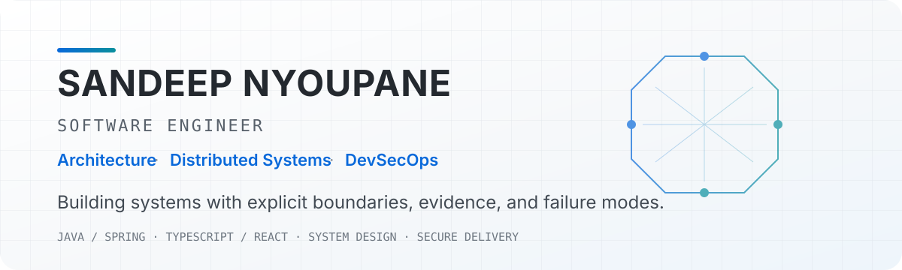
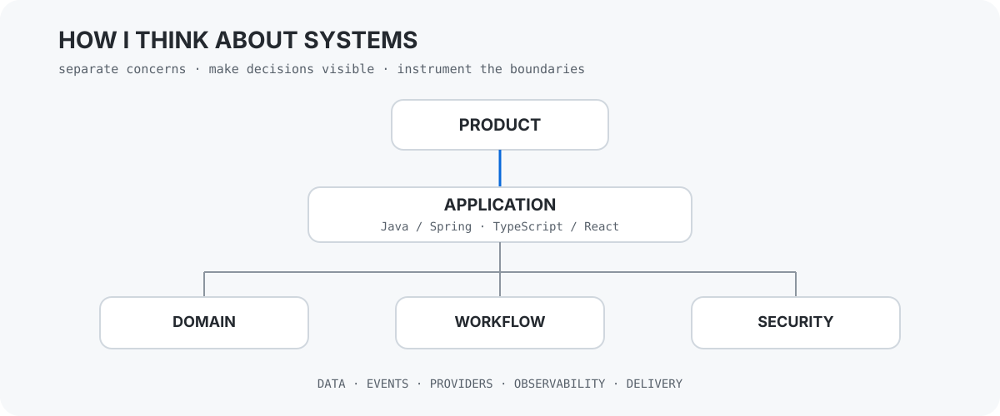

<picture>
  <source media="(prefers-color-scheme: dark)" srcset="./assets/hero-dark.svg">
  <source media="(prefers-color-scheme: light)" srcset="./assets/hero-light.svg">
  
</picture>

<div align="center">

[](https://github.com/SandeepN97?tab=repositories)
[](https://github.com/SandeepN97/architect-lab-java)

</div>

## 01 / About

I design and build software from **architecture decisions to production delivery**. My primary application stacks are **Java / Spring Boot** and **TypeScript / React**, with a strong interest in **distributed systems, DevSecOps, observability, workflow design, secure delivery, and AI-assisted engineering**.

I care about systems that are not only functional, but also **understandable, testable, secure, observable, and explicit about their tradeoffs**. I use architecture boundaries, ADRs, diagrams, automated quality gates, security tooling, and living documentation to make those decisions visible.

---

## 02 / Featured Engineering

<table>
<tr>
<td width="50%" valign="top">

### 🏗️ [ArchitectLab](https://github.com/SandeepN97/architect-lab-java)
**Learn distributed systems by changing them.**

`Java` `Spring Boot` `React` `Redis` `Kafka/Redpanda` `OpenTelemetry`

An interactive system-design playground for experimenting with **rate limiting, traffic generation, failure injection, event streams, RBAC, Prometheus, Grafana, and distributed-system behavior**.

**Search territory:** Java system design · distributed systems · observability · rate limiting

</td>
<td width="50%" valign="top">

### 🛡️ [InboxGuard](https://github.com/SandeepN97/inboxguard)
**Hexagonal architecture meets DevSecOps.**

`Java 21` `Spring Boot` `React` `PostgreSQL` `OAuth2`

A Gmail management application demonstrating **hexagonal architecture, enforced dependency boundaries, encrypted credentials, OAuth2, ArchUnit, and a layered security pipeline** using CodeQL, Trivy, Semgrep, Gitleaks and OWASP ZAP.

**Search territory:** Spring Boot · hexagonal architecture · DevSecOps · Gmail OAuth2

</td>
</tr>
<tr>
<td width="50%" valign="top">

### 📈 [EdgeBot](https://github.com/SandeepN97/edgebot)
**Algorithmic-trading research built around evidence.**

`Python` `Clean Architecture` `Backtesting` `Risk Management`

A research-driven trading system focused on **sealed holdout validation, explicit failed-strategy findings, risk controls, paper-trading boundaries, reproducible experiments, and 130+ tests**.

**Search territory:** algorithmic trading · backtesting · clean architecture · research validation

</td>
<td width="50%" valign="top">

### 🏢 [Samjhana Ventures OS](https://github.com/SandeepN97/samjhana-ventures-os)
**Bilingual multi-business ERP for real operations.**

`Java 21` `Spring Boot` `React` `JWT` `i18n`

A Nepal–USA family-business operating system spanning **furniture, fuel, EV charging, rentals, loans, pricing, finance, role-based access, and bilingual workflows** for practical non-technical users.

**Search territory:** Spring Boot ERP · domain modeling · business software · internationalization

</td>
</tr>
</table>

---

## 03 / What I Build

| Applications | Systems | Engineering |
| --- | --- | --- |
| Java 21 / Spring Boot | Distributed-system patterns | CI/CD & release gates |
| TypeScript / React / Astro | Event-driven workflows | DevSecOps |
| REST APIs & full-stack apps | Caching, messaging & rate limiting | Observability |
| PostgreSQL & domain modeling | Automation & workflow boundaries | ADRs, C4 & architecture docs |

---

## 04 / Engineering Principles

```text
01  Architecture should constrain the code, not decorate the README.
02  Important technical decisions deserve explicit records.
03  Security belongs in the delivery pipeline.
04  Observability is part of system behavior, not an afterthought.
05  Automation needs explicit authority boundaries.
06  Documentation should evolve with the system it describes.
07  Tests should validate assumptions, not merely improve a badge.
```

---

## 05 / Systems Thinking

<picture>
  <source media="(prefers-color-scheme: dark)" srcset="./assets/systems-dark.svg">
  <source media="(prefers-color-scheme: light)" srcset="./assets/systems-light.svg">
  
</picture>

I tend to separate **product intent, application behavior, domain rules, workflows, security, infrastructure, and observability** so they can change independently without turning the whole system into one dependency graph.

---

## 06 / Engineering Toolbox

**Core**  
`Java 21` · `Spring Boot` · `TypeScript` · `JavaScript` · `React` · `Astro` · `SQL` · `REST`

**Systems & Data**  
`PostgreSQL` · `Redis` · `Kafka / Redpanda` · `Docker` · `Cloudflare` · `GitHub Actions`

**Reliability & Security**  
`Prometheus` · `Grafana` · `OpenTelemetry` · `CodeQL` · `Trivy` · `Semgrep` · `Gitleaks` · `OWASP ZAP`

**Architecture**  
`Hexagonal Architecture` · `Clean Architecture` · `C4` · `ADRs` · `Event-driven design` · `Workflow orchestration`

**AI-assisted Engineering**  
`Provider abstraction` · `Context boundaries` · `Human-in-the-loop review` · `Machine-readable documentation` · `Evidence-driven workflows`

---

## 07 / Current Focus

I am currently deepening my work around **distributed systems, architecture enforcement, secure delivery, observability, and AI-assisted engineering workflows**.

**ArchitectLab** is my primary system-design learning surface, while **InboxGuard**, **EdgeBot**, and **Samjhana Ventures OS** keep architecture, security, empirical validation, and domain modeling grounded in working software.

---

## 08 / Repository Map

| Project | Primary signal |
| --- | --- |
| [architect-lab-java](https://github.com/SandeepN97/architect-lab-java) | distributed systems · observability · system design |
| [inboxguard](https://github.com/SandeepN97/inboxguard) | Java · hexagonal architecture · DevSecOps |
| [edgebot](https://github.com/SandeepN97/edgebot) | clean architecture · testing · empirical validation |
| [samjhana-ventures-os](https://github.com/SandeepN97/samjhana-ventures-os) | full-stack ERP · domain modeling · i18n |
| [dividendlens](https://github.com/SandeepN97/dividendlens) | data-driven financial analysis |

---

<div align="center">

### Build deliberately. Document the decisions. Verify the system.

[**View all repositories →**](https://github.com/SandeepN97?tab=repositories)

</div>
